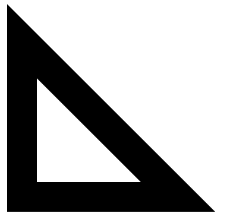

# canvas
 practice with canvas


[link](https://hydr0bius.github.io/canvas/)

Reliazación de una bandera con canvas, se establece primero las dimenciones, despues se utliza *fillstyle* para definir el color que se quiera usar.
```Js
e.fillStyle = "lightgrey";
```
utilizamos el **fillRect** para rellenar el rectangulo con las dimenciones especificadas, como se muestra a continuación.
```Js
e.fillRect(0,0,600,500);
```


se aplican los mismos procedimientos que en el diseño anterior.


Para el caso del triangulo usamos una tecnica diferente es cual es **beginPath** el cual sirve para decirle que vamos a comenzar a dibuar un camino.

```Js
c.beginPath();
```
Seguido de esto se utiliza el **moveTo** para colocar la posicion inicial para empezar el trazo respecto al valor de **X** y **Y**.

```Js
c.moveTo(50,50);
```
A continuacion usamos **lineTo()** el cual nos permite dibujar una línea recta.

```Js
c.lineTo(50,400);
```
Para finalizar se utliza el **fill** para rellenar

```Js
c.fill();
```

Quedando asi finalizado nuestro rectangulo. El motivo por el cual el centro es blanco es porque se a puesto otro triangulo enfrente de este con su respectivo color.

